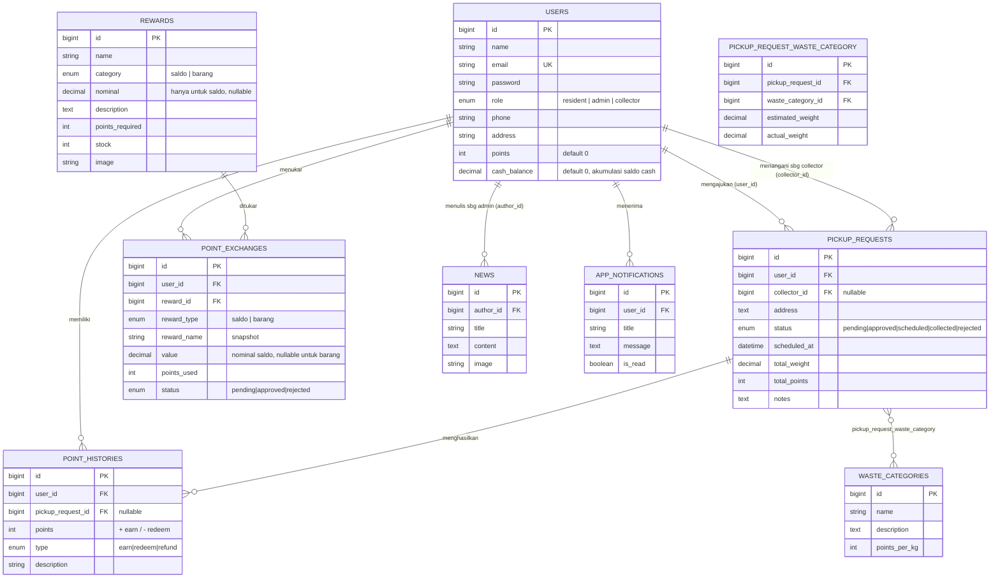

# Entity Relationship Diagram — TemJi

Diagram ini merepresentasikan **persis** struktur tabel di `database/migrations/`.
Dibuat dalam sintaks [Mermaid](https://mermaid.js.org/), otomatis di-render sebagai
diagram visual oleh GitHub saat file ini dibuka di browser.

## 1. Diagram Relasi Entitas

## 2. Pemetaan Migration ↔ Use Case

| File Migration | Tabel | Use Case Terkait (dari diagram use case TemJi) |
|---|---|---|
| `0001_01_01_000000_create_users_table.php` | `users` | dasar autentikasi semua actor |
| `2024_01_01_000001_add_role_and_profile_to_users_table.php` | `users` (+kolom) | pembeda role: Resident / Admin / Collector |
| `2024_01_01_000002_create_waste_categories_table.php` | `waste_categories` | "Mengelola kategori sampah" (Admin) |
| `2024_01_01_000003_create_pickup_requests_table.php` | `pickup_requests` | "Mengajukan pengambilan sampah" (Resident), "Mengelola data pengajuan sampah" (Admin), "Melihat antrean penjemputan" (Collector) |
| `2024_01_01_000004_create_pickup_request_waste_category_table.php` | `pickup_request_waste_category` (**pivot, Many-to-Many**) | "Memilih kategori sampah" `<<Include>>` |
| `2024_01_01_000005_create_point_histories_table.php` | `point_histories` | "Melihat riwayat poin" (Resident) |
| `2024_01_01_000006_create_rewards_table.php` | `rewards` | "Mengelola penukaran poin" (Admin) — sisi katalog |
| `2024_01_01_000007_create_point_exchanges_table.php` | `point_exchanges` | "Melakukan penukaran poin" (Resident) `<<Include>>` "Mengelola penukaran poin" (Admin) |
| `2024_01_01_000008_create_news_table.php` | `news` | "Melihat info berita terbaru" (Resident) |
| `2024_01_01_000009_create_app_notifications_table.php` | `app_notifications` | "Menerima notifikasi atau berita terbaru" (Resident) |
| `2025_01_01_000010_add_refund_to_point_histories_type.php` | `point_histories` (+enum value) | pengembalian poin saat Admin menolak penukaran |
| `2025_01_02_000011_add_category_and_nominal_to_rewards_table.php` | `rewards` (+category saldo/barang, nominal) | pembeda reward saldo & barang pada katalog |
| `2026_09_07_000012_add_cash_balance_to_users_table.php` | `users` (+cash_balance) | akumulasi saldo cash reward yang disetujui |
| `2026_09_07_000013_add_snapshot_columns_to_point_exchanges_table.php` | `point_exchanges` (+reward_type, reward_name, value) | Redemption History Log mandiri (snapshot katalog) |

## 3. Relasi Wajib (sesuai requirement)

| Requirement | Implementasi |
|---|---|
| **1-to-Many** | `User → PickupRequest` (sbg resident & sbg collector, dua foreign key berbeda), `User → PointHistory`, `User → PointExchange`, `User → News`, `User → AppNotification`, `Reward → PointExchange` |
| **Many-to-Many (wajib pivot)** | `PickupRequest ↔ WasteCategory` lewat tabel `pickup_request_waste_category`, dengan kolom tambahan `estimated_weight` & `actual_weight` di pivot |
